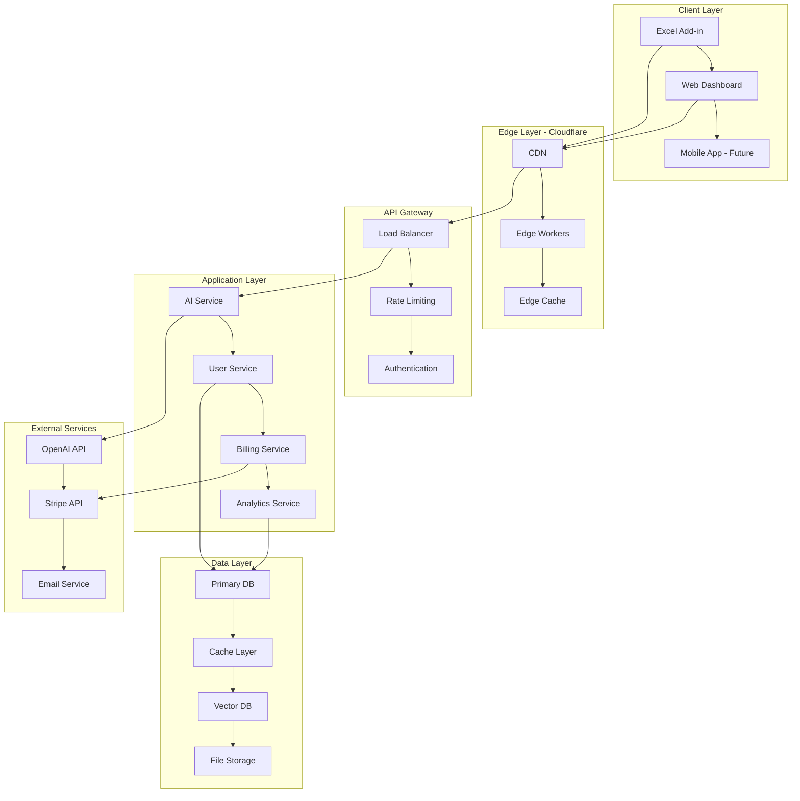
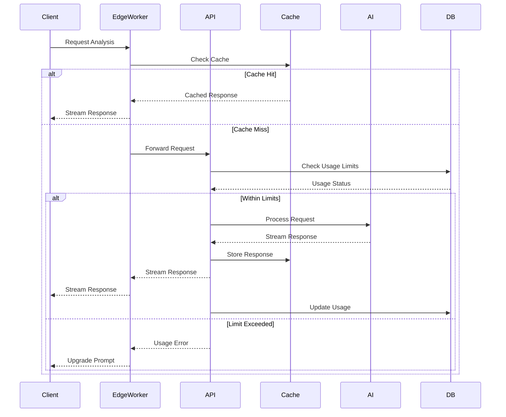

# Architecture Design Document
## AI-Powered Excel Assistant - Modern Cloud-Native Architecture

### Document Information
- **Version**: 1.0
- **Date**: 2025-01-05
- **Architecture Pattern**: Microservices + Event-Driven + Edge-First

---

## 1. Architecture Overview

### 1.1 High-Level Architecture



### 1.2 Architecture Principles

#### **Edge-First Computing**
- Global edge deployment for <100ms response times
- Intelligent caching at multiple layers
- Regional data processing for compliance

#### **Event-Driven Architecture**
- Asynchronous processing for better scalability
- Decoupled services for maintainability
- Real-time updates and notifications

#### **API-First Design**
- Consistent API contracts across services
- Version management and backward compatibility
- Comprehensive API documentation

#### **Zero-Trust Security**
- Authentication at every layer
- Encrypted data in transit and at rest
- Principle of least privilege

---

## 2. System Architecture

### 2.1 Monorepo Structure

```
excel-ai-assistant/
├── apps/
│   ├── web/                    # Next.js 15 Web Dashboard
│   ├── excel-addin/           # Vite + TypeScript Excel Add-in
│   ├── api/                   # Hono API Services
│   └── docs/                  # Documentation Site
├── packages/
│   ├── ui/                    # Shared UI Components
│   ├── database/              # Database Schema & Queries
│   ├── ai/                    # AI Service Logic
│   ├── auth/                  # Authentication Logic
│   ├── billing/               # Billing & Subscription Logic
│   ├── analytics/             # Analytics & Tracking
│   ├── types/                 # Shared TypeScript Types
│   └── config/                # Shared Configuration
├── tools/
│   ├── eslint-config/         # Shared ESLint Config
│   ├── typescript-config/     # Shared TypeScript Config
│   └── tailwind-config/       # Shared Tailwind Config
└── infrastructure/
    ├── terraform/             # Infrastructure as Code
    ├── docker/                # Container Configurations
    └── k8s/                   # Kubernetes Manifests
```

### 2.2 Service Architecture

#### **Microservices Design**

```typescript
// Service boundaries
interface Services {
  userService: {
    authentication: AuthService;
    profile: ProfileService;
    preferences: PreferencesService;
  };
  
  aiService: {
    analysis: AnalysisService;
    generation: GenerationService;
    caching: CacheService;
  };
  
  billingService: {
    subscriptions: SubscriptionService;
    usage: UsageService;
    payments: PaymentService;
  };
  
  analyticsService: {
    tracking: TrackingService;
    reporting: ReportingService;
    insights: InsightsService;
  };
}
```

---

## 3. Data Architecture

### 3.1 Database Design

#### **Primary Database: PlanetScale (MySQL)**

```sql
-- Core Tables
CREATE TABLE users (
  id VARCHAR(36) PRIMARY KEY,
  email VARCHAR(255) UNIQUE NOT NULL,
  name VARCHAR(255) NOT NULL,
  created_at TIMESTAMP DEFAULT CURRENT_TIMESTAMP,
  updated_at TIMESTAMP DEFAULT CURRENT_TIMESTAMP ON UPDATE CURRENT_TIMESTAMP,
  INDEX idx_email (email),
  INDEX idx_created_at (created_at)
);

CREATE TABLE subscriptions (
  id VARCHAR(36) PRIMARY KEY,
  user_id VARCHAR(36) NOT NULL,
  plan_id VARCHAR(50) NOT NULL,
  status ENUM('active', 'canceled', 'past_due', 'trialing') NOT NULL,
  current_period_start TIMESTAMP NOT NULL,
  current_period_end TIMESTAMP NOT NULL,
  stripe_subscription_id VARCHAR(255) UNIQUE,
  created_at TIMESTAMP DEFAULT CURRENT_TIMESTAMP,
  updated_at TIMESTAMP DEFAULT CURRENT_TIMESTAMP ON UPDATE CURRENT_TIMESTAMP,
  FOREIGN KEY (user_id) REFERENCES users(id) ON DELETE CASCADE,
  INDEX idx_user_id (user_id),
  INDEX idx_status (status),
  INDEX idx_period_end (current_period_end)
);

CREATE TABLE usage_records (
  id VARCHAR(36) PRIMARY KEY,
  user_id VARCHAR(36) NOT NULL,
  service_type ENUM('analysis', 'generation', 'explanation') NOT NULL,
  tokens_used INT NOT NULL DEFAULT 0,
  cost_cents INT NOT NULL DEFAULT 0,
  model_used VARCHAR(50) NOT NULL,
  cached BOOLEAN DEFAULT FALSE,
  created_at TIMESTAMP DEFAULT CURRENT_TIMESTAMP,
  FOREIGN KEY (user_id) REFERENCES users(id) ON DELETE CASCADE,
  INDEX idx_user_date (user_id, created_at),
  INDEX idx_service_type (service_type),
  INDEX idx_created_at (created_at)
);
```

#### **Cache Layer: Redis**

```typescript
// Cache Strategy
interface CacheStrategy {
  // AI Response Caching (60% cost reduction)
  aiResponses: {
    key: string; // hash of prompt + context
    ttl: number; // 7 days
    compression: boolean; // gzip compression
  };
  
  // User Session Caching
  userSessions: {
    key: string; // user_id
    ttl: number; // 24 hours
    data: UserSession;
  };
  
  // Usage Tracking Cache
  usageCounters: {
    key: string; // user_id:date
    ttl: number; // 30 days
    increment: boolean; // atomic increments
  };
}
```

#### **Vector Database: Pinecone (Future)**

```typescript
// For semantic search and RAG features
interface VectorStore {
  templates: {
    namespace: 'user_templates';
    dimensions: 1536; // OpenAI embeddings
    metric: 'cosine';
  };
  
  knowledge: {
    namespace: 'excel_knowledge';
    dimensions: 1536;
    metric: 'cosine';
  };
}
```

### 3.2 Data Flow Architecture



---

## 4. Security Architecture

### 4.1 Authentication & Authorization

#### **Multi-Layer Security**

```typescript
// Security Layers
interface SecurityLayers {
  // Layer 1: Edge Security
  edge: {
    ddosProtection: CloudflareDDoS;
    rateLimiting: EdgeRateLimit;
    geoBlocking: GeoRestrictions;
  };
  
  // Layer 2: API Gateway Security
  gateway: {
    authentication: JWTValidation;
    authorization: RBACPermissions;
    inputValidation: SchemaValidation;
  };
  
  // Layer 3: Application Security
  application: {
    dataEncryption: AES256Encryption;
    auditLogging: SecurityAuditLog;
    secretsManagement: VaultIntegration;
  };
  
  // Layer 4: Data Security
  data: {
    encryptionAtRest: DatabaseEncryption;
    backupEncryption: BackupSecurity;
    accessLogging: DataAccessAudit;
  };
}
```

#### **JWT Token Strategy**

```typescript
interface TokenStrategy {
  accessToken: {
    expiry: '15m';
    claims: ['user_id', 'plan', 'permissions'];
    algorithm: 'RS256';
  };
  
  refreshToken: {
    expiry: '30d';
    rotation: true;
    httpOnly: true;
    secure: true;
  };
}
```

### 4.2 Data Privacy & Compliance

#### **GDPR/CCPA Compliance**

```typescript
interface PrivacyControls {
  dataMinimization: {
    collection: 'minimal_necessary';
    retention: 'automatic_deletion';
    processing: 'purpose_limited';
  };
  
  userRights: {
    access: 'data_export_api';
    rectification: 'profile_update_api';
    erasure: 'account_deletion_api';
    portability: 'data_download_api';
  };
  
  consent: {
    granular: true;
    withdrawable: true;
    documented: true;
  };
}
```

---

## 5. Performance Architecture

### 5.1 Caching Strategy

#### **Multi-Layer Caching**

```typescript
// Caching Hierarchy
interface CachingLayers {
  // L1: Browser Cache
  browser: {
    staticAssets: '1y';
    apiResponses: '5m';
    userPreferences: '1d';
  };
  
  // L2: CDN Cache (Cloudflare)
  cdn: {
    staticContent: '1y';
    apiResponses: '1h';
    images: '30d';
  };
  
  // L3: Edge Cache (Workers KV)
  edge: {
    aiResponses: '7d';
    userSessions: '1d';
    configuration: '1h';
  };
  
  // L4: Application Cache (Redis)
  application: {
    databaseQueries: '15m';
    computedResults: '1h';
    rateLimitCounters: '1h';
  };
}
```

### 5.2 Performance Optimization

#### **Frontend Performance**

```typescript
// Performance Optimizations
interface FrontendOptimizations {
  bundling: {
    codesplitting: 'route_based';
    treeshaking: 'aggressive';
    compression: 'brotli';
  };
  
  loading: {
    lazyLoading: 'intersection_observer';
    prefetching: 'link_prefetch';
    preloading: 'critical_resources';
  };
  
  rendering: {
    ssr: 'static_generation';
    streaming: 'react_18_concurrent';
    hydration: 'selective_hydration';
  };
}
```

#### **Backend Performance**

```typescript
// Backend Optimizations
interface BackendOptimizations {
  database: {
    connectionPooling: 'pgbouncer';
    queryOptimization: 'explain_analyze';
    indexing: 'composite_indexes';
  };
  
  api: {
    responseCompression: 'gzip_brotli';
    requestBatching: 'graphql_dataloader';
    streaming: 'server_sent_events';
  };
  
  ai: {
    responseStreaming: 'openai_streaming';
    requestBatching: 'batch_processing';
    modelOptimization: 'prompt_caching';
  };
}
```

---

## 6. Scalability Architecture

### 6.1 Horizontal Scaling

#### **Auto-Scaling Strategy**

```typescript
// Scaling Configuration
interface ScalingStrategy {
  frontend: {
    platform: 'vercel_edge_functions';
    scaling: 'automatic';
    regions: ['us-east-1', 'eu-west-1', 'ap-southeast-1'];
  };
  
  api: {
    platform: 'cloudflare_workers';
    scaling: 'zero_to_millions';
    coldStart: '<10ms';
  };
  
  database: {
    platform: 'planetscale';
    scaling: 'horizontal_sharding';
    readReplicas: 'automatic';
  };
}
```

### 6.2 Load Distribution

#### **Traffic Management**

```typescript
// Load Balancing Strategy
interface LoadBalancing {
  geographic: {
    routing: 'latency_based';
    failover: 'automatic';
    healthChecks: 'continuous';
  };
  
  service: {
    algorithm: 'weighted_round_robin';
    stickySession: false;
    circuitBreaker: 'hystrix_pattern';
  };
}
```

---

## 7. Monitoring & Observability

### 7.1 Monitoring Stack

#### **Observability Tools**

```typescript
// Monitoring Configuration
interface MonitoringStack {
  applicationMonitoring: {
    tool: 'sentry';
    features: ['error_tracking', 'performance_monitoring', 'release_tracking'];
  };
  
  infrastructureMonitoring: {
    tool: 'datadog';
    features: ['metrics', 'logs', 'traces', 'synthetics'];
  };
  
  userAnalytics: {
    tool: 'posthog';
    features: ['product_analytics', 'feature_flags', 'session_replay'];
  };
  
  uptimeMonitoring: {
    tool: 'better_uptime';
    features: ['global_monitoring', 'incident_management', 'status_page'];
  };
}
```

### 7.2 Alerting Strategy

#### **Alert Configuration**

```typescript
// Alerting Rules
interface AlertingRules {
  critical: {
    errorRate: '>5%';
    responseTime: '>2s';
    availability: '<99.9%';
    notification: ['pagerduty', 'slack'];
  };
  
  warning: {
    errorRate: '>1%';
    responseTime: '>1s';
    usageSpike: '>200%';
    notification: ['slack', 'email'];
  };
  
  info: {
    deployments: 'all';
    scalingEvents: 'all';
    notification: ['slack'];
  };
}
```

---

## 8. Deployment Architecture

### 8.1 CI/CD Pipeline

#### **Deployment Strategy**

```yaml
# GitHub Actions Workflow
name: Deploy
on:
  push:
    branches: [main]
  pull_request:
    branches: [main]

jobs:
  test:
    runs-on: ubuntu-latest
    steps:
      - uses: actions/checkout@v4
      - uses: actions/setup-node@v4
        with:
          node-version: '20'
          cache: 'pnpm'
      - run: pnpm install
      - run: pnpm test
      - run: pnpm lint
      - run: pnpm type-check
  
  build:
    needs: test
    runs-on: ubuntu-latest
    steps:
      - uses: actions/checkout@v4
      - run: pnpm build
      - run: pnpm test:e2e
  
  deploy:
    needs: build
    if: github.ref == 'refs/heads/main'
    runs-on: ubuntu-latest
    steps:
      - run: pnpm deploy:production
```

### 8.2 Environment Strategy

#### **Multi-Environment Setup**

```typescript
// Environment Configuration
interface Environments {
  development: {
    database: 'local_mysql';
    ai: 'openai_dev_key';
    caching: 'local_redis';
    monitoring: 'disabled';
  };
  
  staging: {
    database: 'planetscale_staging';
    ai: 'openai_staging_key';
    caching: 'redis_cloud';
    monitoring: 'enabled';
  };
  
  production: {
    database: 'planetscale_production';
    ai: 'openai_production_key';
    caching: 'redis_enterprise';
    monitoring: 'full_observability';
  };
}
```

---

## 9. Cost Architecture

### 9.1 Cost Optimization Strategy

#### **Resource Optimization**

```typescript
// Cost Management
interface CostOptimization {
  compute: {
    serverless: 'pay_per_request';
    autoScaling: 'scale_to_zero';
    edgeComputing: 'reduced_latency_costs';
  };
  
  storage: {
    tiering: 'hot_warm_cold';
    compression: 'automatic';
    lifecycle: 'automated_cleanup';
  };
  
  ai: {
    caching: '60%_cost_reduction';
    modelRouting: 'cost_based_selection';
    batching: 'request_optimization';
  };
}
```

### 9.2 Cost Monitoring

#### **Financial Observability**

```typescript
// Cost Tracking
interface CostTracking {
  realTime: {
    aiCosts: 'per_request_tracking';
    infrastructureCosts: 'resource_tagging';
    userCosts: 'per_tenant_allocation';
  };
  
  budgets: {
    monthly: 'automated_alerts';
    perUser: 'usage_based_limits';
    perService: 'cost_center_allocation';
  };
}
```

---

## 10. Disaster Recovery

### 10.1 Backup Strategy

#### **Data Protection**

```typescript
// Backup Configuration
interface BackupStrategy {
  database: {
    frequency: 'continuous';
    retention: '30_days';
    testing: 'weekly_restore_tests';
  };
  
  files: {
    frequency: 'daily';
    retention: '90_days';
    crossRegion: true;
  };
  
  configuration: {
    frequency: 'on_change';
    versioning: 'git_based';
    automation: 'infrastructure_as_code';
  };
}
```

### 10.2 Recovery Procedures

#### **Business Continuity**

```typescript
// Recovery Planning
interface RecoveryPlan {
  rto: '15_minutes'; // Recovery Time Objective
  rpo: '5_minutes';  // Recovery Point Objective
  
  procedures: {
    databaseFailure: 'automatic_failover';
    serviceFailure: 'circuit_breaker_pattern';
    regionFailure: 'multi_region_deployment';
  };
}
```

This architecture provides a solid foundation for building a scalable, performant, and maintainable AI-powered Excel assistant that can grow from startup to enterprise scale.
